# Architecture Diagram Test

This markdown file contains a comprehensive architecture diagram using Mermaid 11.12.2 syntax.

```mermaid
architecture-beta
    group frontend(laptop)[Frontend Layer]
        service webapp(globe)[Web App] in frontend
        service mobile(phone)[Mobile App] in frontend
    
    group api_gateway(cloud)[API Gateway Layer]
        service gateway(server)[API Gateway] in api_gateway
        service auth(lock)[Authentication] in api_gateway
        service cache(disk)[Cache Layer] in api_gateway
    
    group backend(server)[Backend Services]
        service user_service(database)[User Service] in backend
        service order_service(database)[Order Service] in backend
        service payment_service(database)[Payment Service] in backend
    
    group storage(disk)[Storage Layer]
        service main_db(database)[Main Database] in storage
        service file_storage(disk)[File Storage] in storage
        service message_queue(server)[Message Queue] in storage
    
    group external(cloud)[External Services]
        service email(internet)[Email Service] in external
        service analytics(internet)[Analytics] in external
    
    webapp:R --> L:gateway
    mobile:R --> L:gateway
    
    gateway:B --> T:auth
    gateway:R --> L:cache
    
    gateway:B --> T:user_service
    gateway:B --> T:order_service
    gateway:B --> T:payment_service
    
    user_service:R --> L:main_db
    order_service:R --> L:main_db
    payment_service:R --> L:main_db
    
    user_service:B --> T:file_storage
    order_service:B --> T:message_queue
    
    payment_service:R --> L:email
    order_service:R --> L:analytics
```

## Features Demonstrated

This diagram demonstrates all currently available architecture diagram syntax features:

1. **Groups**: Multiple nested groups with icons (laptop, cloud, server, disk)
2. **Services**: Various service nodes with different icons (globe, phone, server, lock, disk, database, internet)
3. **Edges**: Multiple connection types showing relationships between services
4. **Edge Directions**: Using T (Top), B (Bottom), L (Left), R (Right) directional syntax
5. **Layered Architecture**: Frontend, API Gateway, Backend, Storage, and External layers
6. **Complex Relationships**: Multiple services connecting to shared resources
